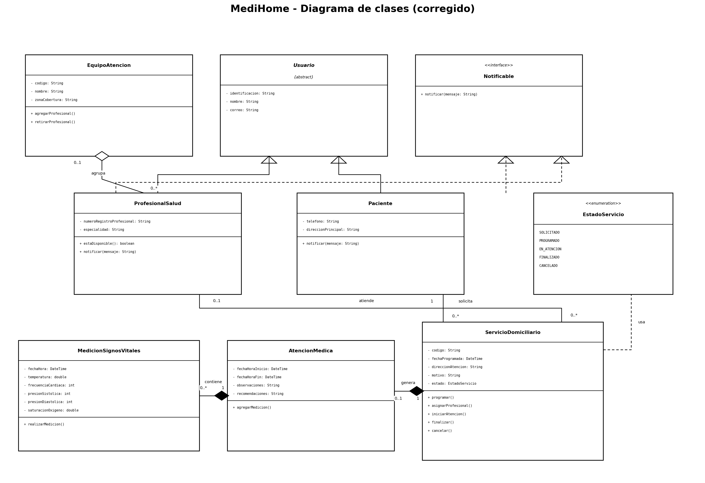

# Medi-Home - Taller de diseño y programación

**Integrantes:** Drako David Salazar y Jose Nicolas Mora
**Materia:** Diseño de Software

## 1. Descripción

Este repositorio contiene el desarrollo del taller del caso Medi Home, una empresa que presta servicios de atención médica domiciliaria y necesitaba un sistema para administrar sus servicios.

El taller pedía, a partir del enunciado visto en clase y del diagrama de clases diseñado en clase:

1. Entregar el diagrama completo diagramado con Visual Paradigm.
2. Desarrollar el programa en Java con las clases modeladas y una clase `main` que instancie un paciente, un profesional, un servicio domiciliario, una atención y una medición de signos vitales, y al final presente un reporte de la atención prestada al paciente.

## 2. Contenido del repositorio

- `Medi Home.md`: enunciado del caso de estudio.
- `MediHome.vpp`: fuente del diagrama de clases para abrir en Visual Paradigm.
- `docs/diagrama-medihome.png`: imagen del diagrama de clases corregido.
- `src/com/medihome/`: código fuente en Java con las clases modeladas y la clase `Main`.
- `README.md`: este archivo.

## 3. Diagrama de clases



Clases:

- `Usuario` (abstracta): identificacion, nombre, correo.
- `Paciente`: telefono, direccionPrincipal. Hereda de `Usuario` e implementa `Notificable`.
- `ProfesionalSalud`: numeroRegistroProfesional, especialidad. Hereda de `Usuario` e implementa `Notificable`.
- `Notificable` (interfaz): operación `notificar(mensaje)`.
- `EquipoAtencion`: codigo, nombre, zonaCobertura. Operaciones `agregarProfesional` y `retirarProfesional`.
- `ServicioDomiciliario`: codigo, fechaProgramada, direccionAtencion, motivo, estado. Operaciones `programar`, `asignarProfesional`, `iniciarAtencion`, `finalizar` y `cancelar`.
- `EstadoServicio` (enumeración): SOLICITADO, PROGRAMADO, EN_ATENCION, FINALIZADO, CANCELADO.
- `AtencionMedica`: fechaHoraInicio, fechaHoraFin, observaciones, recomendaciones.
- `MedicionSignosVitales`: fechaHora, temperatura, frecuenciaCardiaca, presionSistolica, presionDiastolica, saturacionOxigeno.

Relaciones:

- `Paciente` solicita `ServicioDomiciliario` (1 a 0..*).
- `ProfesionalSalud` atiende `ServicioDomiciliario` (0..1 a 0..*).
- `ServicioDomiciliario` genera `AtencionMedica` por composición (1 a 0..1).
- `AtencionMedica` contiene `MedicionSignosVitales` por composición (1 a 0..*).
- `EquipoAtencion` agrupa a `ProfesionalSalud` por agregación.

## 4. Correcciones que le hicimos al diagrama

Revisando el diagrama frente al enunciado encontramos y corregimos lo siguiente:

- Quitamos los espacios al final de los nombres de las clases `Usuario` y `Paciente`.
- Eliminamos las operaciones `getAttribute`, `setAttribute`, `getAttribute2` y `setAttribute2` que se habían generado por error y no corresponden al enunciado.
- Dejamos `Usuario` como clase abstracta, porque solo tiene sentido instanciar `Paciente` o `ProfesionalSalud`.
- Corregimos la multiplicidad de la relación `solicita`: del lado del paciente quedó en `1`, porque cada servicio corresponde a un único paciente.
- El estado del servicio lo manejamos como enumeración `EstadoServicio` con los cinco valores del enunciado (solicitado, programado, en atención, finalizado y cancelado), en vez de un `String` libre.

## 5. Programa en Java

El paquete `com.medihome` tiene las clases del modelo más la clase `Main`, que hace lo siguiente:

1. Crea un paciente y un profesional, y mete al profesional en un equipo de atención.
2. Crea un servicio domiciliario solicitado por el paciente.
3. Programa el servicio, le asigna el profesional e inicia la atención (se muestran las notificaciones).
4. Genera la atención médica del servicio con observaciones y recomendaciones.
5. Registra dos mediciones de signos vitales en la atención.
6. Finaliza el servicio e imprime en consola el reporte de la atención prestada al paciente.

### Cómo compilar y ejecutar (Windows)

```bat
javac -encoding UTF-8 -d out src\com\medihome\*.java
java -cp out com.medihome.Main
```

### Cómo abrir el diagrama

1. Abrir Visual Paradigm.
2. Abrir el archivo `MediHome.vpp`.
3. Ver el diagrama `Medihome` de tipo ClassDiagram.
